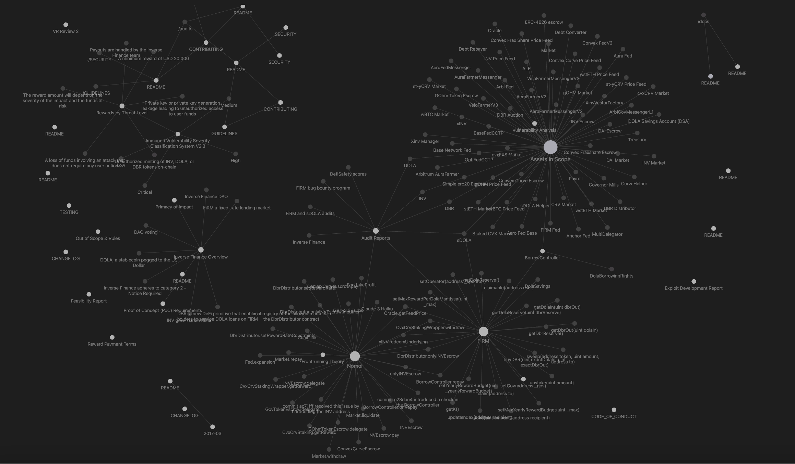

To run the tests in the [ExploitPoCTest](file:///Users/andrewowens/Library/Mobile%20Documents/iCloud~md~obsidian/Documents/InverseFinance/Vulnerability%20Research/Exploit%20Development%20Report.md#1%2C5-1%2C5) contract, you'll need to use the Foundry testing framework, which includes tools like [forge](file:///Users/andrewowens/Library/Mobile%20Documents/iCloud~md~obsidian/Documents/InverseFinance/PoC/test/ExploitPoC.t.sol#8%2C9-8%2C9). Here’s a step-by-step guide on how to execute these tests:

1. **Install Foundry**
   - If Foundry is not installed, you can install it using the following shell command:
     ```bash
     curl -L https://foundry.paradigm.xyz | bash
     foundryup
     ```

2. **Navigate to Your Project Directory**
   - Change to the directory where your Solidity project and the `ExploitPoCTest` contract are located.

3. **Compile the Contracts**
   - Compile your Solidity contracts to ensure all artifacts are up to date:
     ```bash
     forge build
     ```

4. **Run the Tests**
   - Execute the tests using the `forge test` command. You can run all tests or specify a particular test.
   - To run all tests:
     ```bash
     forge test
     ```
   - To run a specific test, use the `--match-test` flag followed by the name of the test function:
     ```bash
     forge test --match-test testNormalBorrowLiquidate
     ```

5. **Review the Output**
   - Foundry will execute the tests and provide a report on the console. This report includes information on which tests passed or failed and any errors or logs generated during the test execution.

6. **Debugging (if necessary)**
   - If any tests fail or behave unexpectedly, you can use `forge` debug tools or add logging statements (`console.log`) in your Solidity code to help diagnose issues.


## Foundry

**Foundry is a blazing fast, portable and modular toolkit for Ethereum application development written in Rust.**

Foundry consists of:

-   **Forge**: Ethereum testing framework (like Truffle, Hardhat and DappTools).
-   **Cast**: Swiss army knife for interacting with EVM smart contracts, sending transactions and getting chain data.
-   **Anvil**: Local Ethereum node, akin to Ganache, Hardhat Network.
-   **Chisel**: Fast, utilitarian, and verbose solidity REPL.

## Documentation

https://book.getfoundry.sh/

## Usage

### Build

```shell
$ forge build
```

### Test

```shell
$ forge test
```

### Format

```shell
$ forge fmt
```

### Gas Snapshots

```shell
$ forge snapshot
```

### Anvil

```shell
$ anvil
```

### Deploy

```shell
$ forge script script/Counter.s.sol:CounterScript --rpc-url <your_rpc_url> --private-key <your_private_key>
```

### Cast

```shell
$ cast <subcommand>
```

### Help

```shell
$ forge --help
$ anvil --help
$ cast --help
```
